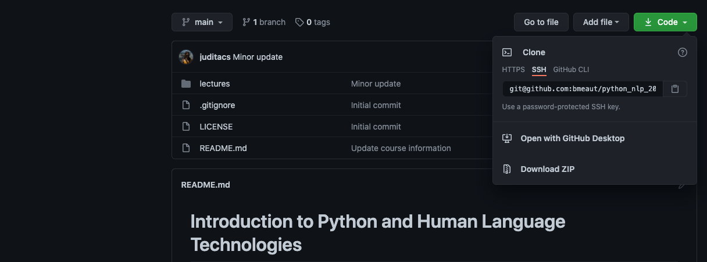

## Git

---
Git is a distributed version-control system used for keeping track of changes in any kind of files. With the help of Git, it is possible for multiple software engineers to work on the same codebase without conflicting each other's work. Therefore it is an essential tool that you need to get familiar with (not only for the sake of this course, but also your future career). GitHub is simply a place that hosts projects that are version controlled with Git. It is important to understand that GitHub is not just a place where you can dump your files (like Google Drive), but a platform which supports software development by giving visibility and transparency to projects of all sizes. Although GitHub supports uploading files manually via the web interface, it is **highly discouraged**. You should only use Git to operate on Github. Git can either be used by using the CLI (command line interface) or a desktop Git client. To use the CLI capabilities of Git under Windows it is encouraged to use Git Bash app (it will most likely come with the default installation). You are also encouraged to use Git Bash later on this course to emulate Linux CLI commands under Windows.

You should be able to set up Git on your computer using the official documentation: https://docs.github.com/en/github/getting-started-with-github/set-up-git

If you prefer to use a desktop client for operating Git and pushing your code to Github, these are the most popular applications:
- GitHub Desktop: https://desktop.github.com/
- GitKraken: https://www.gitkraken.com/
- Tower: https://www.git-tower.com/
- Sublime Merge: https://www.sublimemerge.com/

Here you can find the most common commands of Git with some illustrative examples:
https://dzone.com/articles/top-20-git-commands-with-examples

Please note that for the homeworks we will create the repositories for you which you will be given access to, so you wont need to create your own. For uploading the laboratories you most likely will only need: clone, add, commit and push.
If you would like to gain a deeper and proper understanding of how Git works, we highly recommend this lecture: https://missing.csail.mit.edu/2020/version-control/

## SSH
---
SSH or Secure Shell is a cryptographic network protocol for operating network services securely over an unsecured network. You can download repositories from Github using HTTPS or SSH, but SSH is the preferred way, because this way you can connect to GitHub without supplying your username and personal access token at each visit.



In order to do this, you need to set up SSH. First, you should check if you have generated ssh keys some time in the past that you could use.

```bash
$ ls -al ~/.ssh
# Lists the files in your .ssh directory, if they exist
```
The public key files should look something like this:
- id_rsa.pub
- id_ecdsa.pub
- id_ed25519.pub

If you don't have an ssh public-private keypair, you should create one. This documentation explains it simply, you just have to copy and paste the commands relevant for your system.
https://docs.github.com/en/github/authenticating-to-github/generating-a-new-ssh-key-and-adding-it-to-the-ssh-agent

Once you have done this, you just need to add your **PUBLIC** SSH key on the GitHub UI. This guide will walk you through that. https://docs.github.com/en/github/authenticating-to-github/adding-a-new-ssh-key-to-your-github-account

After this, you are all set up to clone repositories with SSH.

## Jupyter
---

Jupyter notebooks are web-based interactive development environments. They are mostly used for experimental development, testing out small scripts or doing data analysis. For this reason, Jupyter notebooks are suitable for completing the homework assignments. Installing it is fairly straightforward. We recommend doing it via the package manager conda (either the miniconda or the miniforge conda distributions include a minimal conda installation). You can do this by either installing the whole Anaconda distribution from: https://docs.anaconda.com/anaconda/install/, or just a miniconda installation (this requires less disk place): https://docs.conda.io/en/latest/miniconda.html. In your terminal, you should run (on Windows you should use Git bash for executing the commands):

```bash
conda install -c conda-forge notebook
```
In case you don’t want to use conda, you could install it with pip as well:
```bash
pip install notebook
```
After you have installed Jupyter Notebook on your computer, you are ready to start your local jupyter server. To do this, you need to navigate to the folder, where your notebook project is located or where you want to create it. In case of the homeworks, this is going to be the folder containing the repository that you acquire from GitHub using the git clone command. Once you are there, you just run (under Windows in case you have installed the Anaconda distribution, you can open Anaconda prompt and navigate to the proper directory as well, if you use miniconda you can use Git Bash the same way):
```bash
jupyter notebook
```
which will start the server. After this, you should be able to see the jupyter dashboard in your browser on localhost. Once you typed the jupyter notebook command, you can copy the url from the output in your command prompt, which will look like this: `http://localhost:8888/?token=<an_auth_token>`.
Just copy this into a browser and you are good to go. 

